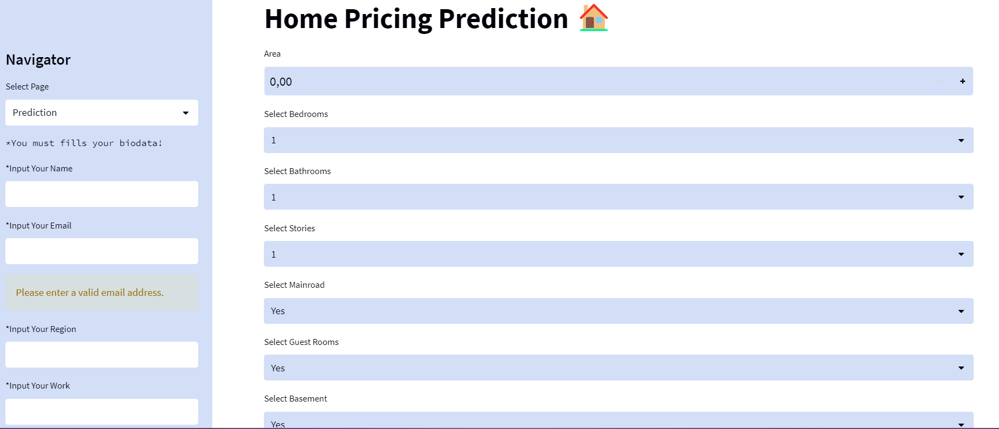
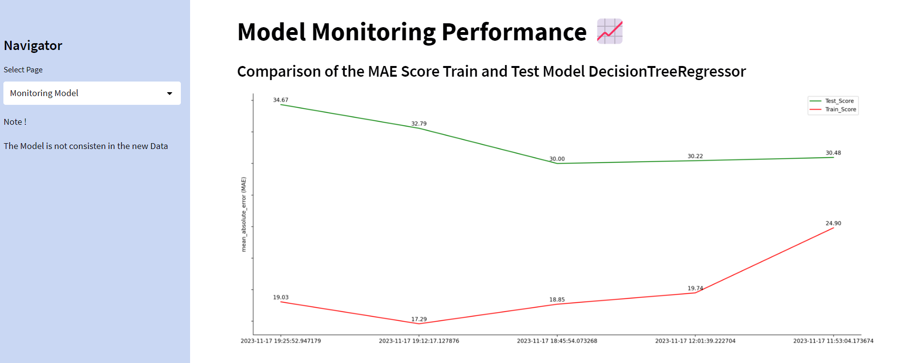
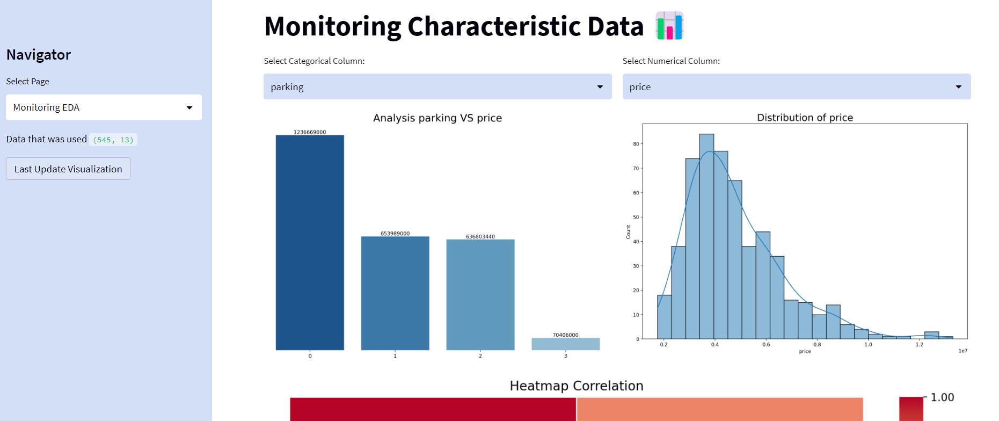
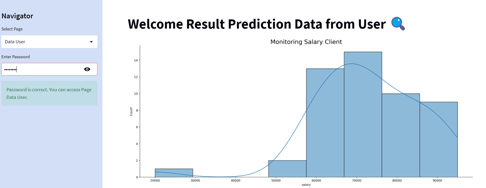

# Project: Monitoring House Price Prediction Model
User:
People interested in buying or selling houses.

# Objective:
Create a dashboard to monitor the performance of a model predicting house prices.

# Project Steps:
Data Collection from Database:

Fetch house price data from a reliable source or database.
## Data Cleaning:

Identify and handle missing values or anomalies in the data. Ensure the data is clean and reliable for analysis.
#Data Pipeline:

Create a data pipeline to automate the data processing process, including data type conversion, normalization, and other necessary steps.
## Exploratory Data Analysis (EDA):

Perform exploratory data analysis to understand patterns, distributions, and relationships among features. This helps in feature selection for the model.
Preprocessing / Feature Engineering:

Perform data preprocessing and feature engineering to prepare the data for model training. This includes handling missing values, feature transformations, and scaling adjustments.
## Modeling:

Utilize machine learning models such as Linear Regression, Decision Tree, and KNN to predict house prices. Use the MAE (Mean Absolute Error) metric for model evaluation.
## Back-end: FastAPI:

Implement the back-end using FastAPI to provide an API service that can be used by the front-end.
## Front-end: Streamlit:

Create a dashboard using Streamlit to visualize the model predictions and evaluation metrics. The dashboard should provide a clear understanding of the model's performance.
Selecting the Best Model:

Implement the best model into the dashboard and deploy using a suitable platform.
Monitoring and Maintenance:

Regularly monitor the model's performance and update the model if necessary. Provide routine maintenance to ensure prediction accuracy.
User Training:

Provide user training to effectively use the dashboard and understand the model predictions.

## Additional Notes:
- The best model for this dataset is linear regression.
- Choose the model evaluation method (MAE) based on the project's specific needs, especially if the data is sensitive to outliers.
- Include comprehensive documentation for each step of the project, including model selection and interpretation of results.
- Ensure the dashboard provides a user-friendly and informative interface.
- I have created sample data, and I observed that the model assumptions are inconsistent as they exceed the 10% threshold.

## Dashboard on Streamlit:
Page-1:
Input user biodata and generate predictions

 

Page-2:
Model monitoring, providing scores for each model

 

Page-3:
Exploratory Data Analysis (EDA) - Understanding characteristic data used in the model
 
 

Page-4:
User data - utilizing the information from Page-1 input to recommend suitable houses based on user preferences
 
 

